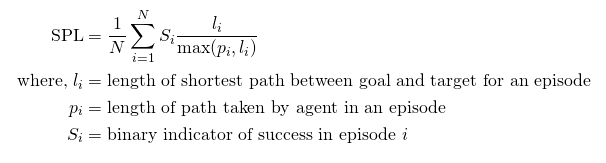
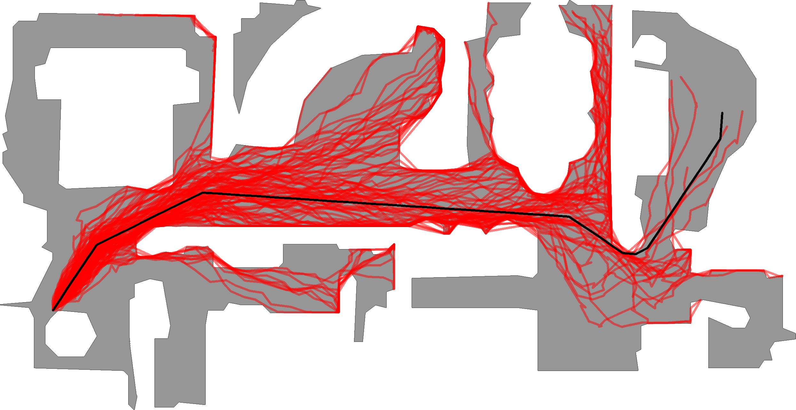

<p align="center">
  
  </p>

--------------------------------------------------------------------------------

# Habitat Challenge 2020

This repository contains starter code for the 2020 challenge, details of the tasks, and training and evaluation setups. For an overview of habitat-challenge visit [aihabitat.org/challenge](https://aihabitat.org/challenge/). 

If you are looking for our 2019 starter code, it's available in the [`challenge-2019 branch`](https://github.com/facebookresearch/habitat-challenge/tree/challenge-2019).

This year, we are hosting challenges on two embodied navigation tasks: 
1. PointNav (*‘Go 5m north, 3m west relative to start’*)
1. ObjectNav (*‘find a chair’*). 

Task #1: PointNav focuses on realism and *sim2real predictivity* (the ability to predict the performance of a nav-model on a real robot from its performance in simulation). 

Task #2: ObjectNav focuses on egocentric object/scene recognition and a commonsense understanding of object semantics (where is a fireplace typically located in a house?). 


## Task 1: PointNav 
In PointNav, an agent is spawned at a random starting position and orientation in an unseen environment and and asked to navigate to target coordinates specified relative to the agent’s start location (*‘Go 5m north, 3m west relative to start’*). No ground-truth map is available and the agent must only use its sensory input (an RGB-D camera) to navigate. 

### Dataset
We use [Gibson 3D scenes](http://gibsonenv.stanford.edu/database/) for the challenge. As in the 2019 Habitat challenge, we use the splits provided by the Gibson dataset, retaining the train and val sets, and separating the test set into test-standard and test-challenge. The train and val scenes are provided to participants. The test scenes are used for the official challenge evaluation and are not provided to participants. Note: The agent size has changed from 2019, thus the navigation episodes have changed (a wider agent in 2020 rendered many of 2019 episodes unnavigable). 

### Evaluation
After calling the STOP action, the agent is evaluated using the 'Success weighted by Path Length' (SPL) metric [2]. 

<p align="center">
  
</p>


An episode is deemed successful if on calling the STOP action, the agent is within 0.36m (2x agent-radius) of the goal position.


### New in 2020
The main emphasis in 2020 is on increased realism and on sim2real predictivity (the ability to predict performance on a real robot from its performance in simulation). 

Specifically, we introduce the following changes inspired by our experiments and findings in [3]: 

1. **No GPS+Compass sensor**: In 2019, the relative coordinates specifying the goal were continuously updated during agent movement &mdash; essentially simulating an agent with perfect localization and heading estimation (*e.g.* an agent with an idealized GPS+Compass). However, high-precision localization in indoor environments can not be assumed in realistic settings &mdash; GPS has low precision indoors, (visual) odometry may be noisy, SLAM-based localization can fail, etc. Hence, in 2020's challenge the agent does NOT have a GPS+Compass sensor and must navigate solely using an egocentric RGB-D camera. This change elevates the need to perform RGBD-based online localization. 

1. **Noisy Actuation and Sensing**: In 2019, the agent actions were deterministic &mdash; *i.e.* when the agent executes *turn-left 30 degrees*, it turns *exactly* 30 degrees, and forward 0.25 m moves the agent *exactly* 0.25 m forward (modulo collisions). However, no robot moves deterministically &mdash; actuation error, surface properties such as friction, and a myriad of other sources of error introduce significant drift over a long trajectory. To model this, we introduce a noise model acquired by benchmarking the [Locobot](http://www.locobot.org/) robot by the [PyRobot](https://www.pyrobot.org/) team. We also added RGB and Depth sensor noises. 

    <p align="center">
      
    </p>
    Figure shows the effect of actuation noise. The black line is the trajectory of an action sequence with perfect actuation (no noise). In red are multiple rollouts of this action sequence sampled from the actuation noise model. As we can see, identical action sequences can lead to vastly different final locations.

1. **Collision Dynamics and ‘Sliding'**: In 2019, when the agent takes an action that results in a collision, the agent *slides* along the obstacle as opposed to stopping. This behavior is prevalent in video game engines as it allows for smooth human control; it is also enabled by default in MINOS, Deepmind Lab, AI2 THOR, and Gibson v1. We have found that this behavior enables 'cheating' by learned agents &mdash; the agents exploit this sliding mechanism to take an effective path that appears to travel *through non-navigable regions* of the environment (like walls). Such policies fail disastrously in the real world where the robot bump sensors  force a stop on contact with obstacles. To rectify this issue, we modify [Habitat-Sim to disable sliding on collisions](https://github.com/facebookresearch/habitat-sim/pull/439). 

1. **Multiple cosmetic/minor changes**: Change in robot embodiment/size, camera resolution, height, and orientation, etc &mdash; to match LoCoBot. 


## Task 2: ObjectNav

In ObjectNav, an agent is initialized at a random starting position and orientation in an unseen environment and asked to find an instance of an object category (*‘find a chair’*) by navigating to  it. A map of the environment is not provided and the agent must only use its sensory input to navigate. 

The agent is equipped with an RGB-D camera and a (noiseless) GPS+Compass sensor. GPS+Compass sensor provides the agent’s current location and orientation information relative to the start of the episode. We attempt to match the camera specification (field of view, resolution) in simulation to the Azure Kinect camera, but this task does not involve any injected sensing noise. 

### Dataset
We use 90 of the [Matterport3D scenes (MP3D)](https://niessner.github.io/Matterport/) with the standard splits of train/val/test as prescribed by Anderson *et al.* [2]. MP3D contains 40 annotated categories. We hand-select a subset of 21 by excluding categories that are not visually well defined (like doorways or windows) and architectural elements (like walls, floors, and ceilings). 

### Evaluation
We generalize the PointNav evaluation protocol used by [1,2,3] to ObjectNav. At a high-level, we measure performance along the same two axes:  
- **Success**: Did the agent navigate to an instance of the goal object? (Notice: *any* instance, regardless of distance from starting location.)
- **Efficiency**: How efficient was the agent's path compared to an optimal path? (Notice: optimal path = shortest path from the agent's starting position to the *closest* instance of the target object category.)

Concretely, an episode is deemed successful if on calling the STOP action, the agent is within 1.0m Euclidean distance from any instance of the target object category AND the object *can be viewed by an oracle* from that stopping position by turning the agent or looking up/down. Notice: we do NOT require the agent to be actually viewing the object at the stopping location, simply that the such oracle-visibility is possible without moving. Why? Because we want participants to focus on *navigation* not object framing. In the larger goal of Embodied AI, the agent is navigating to an object instance in order to interact with is (say point at or manipulate an object). Oracle-visibility is our proxy for *'the agent is close enough to interact with the object'*. 

ObjectNav-SPL is defined analogous to PointNav-SPL. The only key difference is that the shortest path is computed to the object instance closest to the agent start location. Thus, if an agent spawns very close to *'chair1'* but stops at a distant *'chair2'*, it will be achieve 100% success (because it found a *'chair'*) but a fairly low SPL (because the agent path is much longer compared to the oracle path). 

## Participation Guidelines

Participate in the contest by registering on the [EvalAI challenge page](https://evalai.cloudcv.org/web/challenges/challenge-page/580/overview) and creating a team. Participants will upload docker containers with their agents that evaluated on a AWS GPU-enabled instance. Before pushing the submissions for remote evaluation, participants should test the submission docker locally to make sure it is working. Instructions for training, local evaluation, and online submission are provided below.

### Local Evaluation

1. Clone the challenge repository:  

    ```bash
    git clone https://github.com/facebookresearch/habitat-challenge.git
    cd habitat-challenge
    ```

1. Implement your own agent or try one of ours. We provide an agent in `agent.py` that takes random actions:
    ```python
    import habitat

    class RandomAgent(habitat.Agent):
        def reset(self):
            pass

        def act(self, observations):
            return {"action": numpy.random.choice(task_config.TASK.POSSIBLE_ACTIONS)}

    def main():
        agent = RandomAgent(task_config=config)
        challenge = habitat.Challenge()
        challenge.submit(agent)
    ```
    [Optional] Modify submission.sh file if your agent needs any custom modifications (e.g. command-line arguments). Otherwise, nothing to do. Default submission.sh is simply a call to `RandomAgent` agent in `agent.py`. 


1. Install [nvidia-docker v2](https://github.com/NVIDIA/nvidia-docker) following instructions here: [https://github.com/nvidia/nvidia-docker/wiki/Installation-(version-2.0)](https://github.com/nvidia/nvidia-docker/wiki/Installation-(version-2.0)). 
Note: only supports Linux; no Windows or MacOS.

1. Modify the provided Dockerfile if you need custom modifications. Let's say your code needs `pytorch`, these dependencies should be pip installed inside a conda environment called `habitat` that is shipped with our habitat-challenge docker, as shown below:

    ```dockerfile
    FROM fairembodied/habitat-challenge:2020

    # install dependencies in the habitat conda environment
    RUN /bin/bash -c ". activate habitat; pip install torch"

    ADD agent.py /agent.py
    ADD submission.sh /submission.sh
    ```
    Build your docker container: `docker build . --file Pointnav.Dockerfile  -t pointnav_submission` or using `docker build . --file Objectnav.Dockerfile  -t objectnav_submission`. (Note: you may need `sudo` priviliges to run this command.)

1. a) PointNav: Download Gibson scenes used for Habitat Challenge. Accept terms [here](https://docs.google.com/forms/d/e/1FAIpQLScWlx5Z1DM1M-wTSXaa6zV8lTFkPmTHW1LqMsoCBDWsTDjBkQ/viewform) and select the download corresponding to “Habitat Challenge Data for Gibson (1.5 GB)“. Place this data in: `habitat-challenge/habitat-challenge-data/data/scene_datasets/gibson`
   
   b) ObjectNav: Download Matterport3D scenes used for Habitat Challenge [here](https://niessner.github.io/Matterport/). Place this data in: `habitat-challenge/habitat-challenge-data/data/scene_datasets/mp3d`


    **Using Symlinks:**  If you used symlinks (i.e. `ln -s`) to link to an existing download of Gibson or MP3D, there is an additional step.  For  ObjectNav/MP3D (and similarly for PointNav/Gibson),
    first make sure there is only one level of symlink (instead of a symlink to a symlink link to a .... symlink) with
      ```bash
      ln -f -s $(realpath habitat-challenge-data/data/scene_datasets/mp3d) \
          habitat-challenge-data/data/scene_datasets/mp3d
      ```
     
     Then modify the docker command `test_locally_objectnav_rgbd` to mount the linked to location by adding 
     `-v $(realpath habitat-challenge-data/data/scene_datasets/mp3d)`.  The modified docker command
     would be
     ```bash
      docker run \
          -v $(pwd)/habitat-challenge-data:/habitat-challenge-data \
          -v $(realpath habitat-challenge-data/data/scene_datasets/mp3d) \
          --runtime=nvidia \
          -e "AGENT_EVALUATION_TYPE=local" \
          -e "TRACK_CONFIG_FILE=/challenge_objectnav2020.local.rgbd.yaml" \
          ${DOCKER_NAME}
    ```

1. Evaluate your docker container locally:
    ```bash
    # Testing PointNav
    ./test_locally_pointnav_rgbd.sh --docker-name pointnav_submission
    
    # Testing ObjectNav
    ./test_locally_objectnav_rgbd.sh --docker-name objectnav_submission
    ```
    If the above command runs successfully you will get an output similar to:
    ```
    2019-02-14 21:23:51,798 initializing sim Sim-v0
    2019-02-14 21:23:52,820 initializing task Nav-v0
    2020-02-14 21:23:56,339 distance_to_goal: 5.205519378185272
    2020-02-14 21:23:56,339 spl: 0.0
    ```
    Note: this same command will be run to evaluate your agent for the leaderboard. **Please submit your docker for remote evaluation (below) only if it runs successfully on your local setup.**  

### Online submission

Follow instructions in the `submit` tab of the EvalAI challenge page (coming soon) to submit your docker image. Note that you will need a version of EvalAI `>= 1.3.5`. Pasting those instructions here for convenience:

```bash
# Installing EvalAI Command Line Interface
pip install "evalai>=1.3.5"

# Set EvalAI account token
evalai set_token <your EvalAI participant token>

# Push docker image to EvalAI docker registry
# Pointnav
evalai push pointnav_submission:latest --phase <phase-name>

# Objectnav
evalai push objectnav_submission:latest --phase <phase-name>
```

Valid challenge phases are `habitat20-{pointnav, objectnav}-{minival, test-std, test-ch}`.

The challenge consists of the following phases:

1. **Minival phase**: This split is same as the one used in `./test_locally_{pointnav, objectnav}_rgbd.sh`. The purpose of this phase/split is sanity checking -- to confirm that our remote evaluation reports the same result as the one you're seeing locally. Each team is allowed maximum of 30 submission per day for this phase, but please use them judiciously. We will block and disqualify teams that spam our servers. 
1. **Test Standard phase**: The purpose of this phase/split is to serve as the public leaderboard establishing the state of the art; this is what should be used to report results in papers. Each team is allowed maximum of 10 submission per day for this phase, but again, please use them judiciously. Don't overfit to the test set. 
1. **Test Challenge phase**: This phase/split will be used to decide challenge winners. Each team is allowed total of 5 submissions until the end of challenge submission phase. The highest performing of these 5 will be automatically chosen. Results on this split will not be made public until the announcement of final results at the [Embodied AI workshop at CVPR](https://embodied-ai.org/). 
1. **Optional Test Challenge phase for PointNav track (Habitat to Gibson sim2real)**: Top-5 teams from the Habitat Test Standard phase will have a chance to participate in the [Gibson Sim2Real Challenge](http://svl.stanford.edu/gibson2/challenge.html>) for their Phase 2 (Real World phase) and potentially Phase 3 (Demo phase). Additional submission to the Gibson challenge will be required.

Note: Your agent will be evaluated on 1000-2000 episodes and will have a total available time of 24 hours to finish. Your submissions will be evaluated on AWS EC2 p2.xlarge instance which has a Tesla K80 GPU (12 GB Memory), 4 CPU cores, and 61 GB RAM. If you need more time/resources for evaluation of your submission please get in touch. If you face any issues or have questions you can ask them by opening an issue on this repository.

### PointNav/ObjectNav Baselines and DD-PPO Training Starter Code
We have added a config in `configs/ddppo_pointnav.yaml | configs/ddppo_objectnav.yaml` that includes a baseline using DD-PPO from Habitat-Lab. 

1. Install the [Habitat-Sim](https://github.com/facebookresearch/habitat-sim/) and [Habitat-Lab](https://github.com/facebookresearch/habitat-lab/) packages. Also ensure that habitat-baselines is installed when installing Habitat-Lab by installing it with ```python setup.py develop --all```

1. Download the Gibson dataset following the instructions [here](https://github.com/StanfordVL/GibsonEnv#database). After downloading extract the dataset to folder `habitat-challenge/habitat-challenge-data/data/scene_datasets/gibson/` folder (this folder should contain the `.glb` files from gibson). Note that the `habitat-lab` folder is the [habitat-lab](https://github.com/facebookresearch/habitat-lab/) repository folder. The data also needs to be in the habitat-challenge-data/ in this repository.

1. **Pointnav**: Download the dataset for Gibson PointNav from [link](https://dl.fbaipublicfiles.com/habitat/data/datasets/pointnav/gibson/v2/pointnav_gibson_v2.zip) and place it in the folder `habitat-challenge/habitat-challenge-data/data/datasets/pointnav/gibson`. If placed correctly, you should have the train and val splits at `habitat-challenge/habitat-challenge-data/data/datasets/pointnav/gibson/v2/train/` and `habitat-challenge/habitat-challenge-data/data/datasets/pointnav/gibson/v2/val/` respectively. Place Gibson scenes downloaded in step-4 of local-evaluation under the `habitat-challenge/habitat-challenge-data/data/scene_datasets` folder. If you have already downloaded thes files for the habitat-lab repo, you may simply symlink them using `ln -s $PATH_TO_SCENE_DATASETS habitat-challenge-data/data/scene_datasets` (if on OSX or Linux).

    **Objectnav**: Download the episodes dataset for Matterport3D ObjectNav from [link](https://dl.fbaipublicfiles.com/habitat/data/datasets/objectnav/m3d/v1/objectnav_mp3d_v1.zip) and place it in the folder `habitat-challenge/habitat-challenge-data/data/datasets/objectnav/mp3d`. If placed correctly, you should have the train and val splits at `habitat-challenge/habitat-challenge-data/data/datasets/objectnav/mp3d/v1/train/` and `habitat-challenge/habitat-challenge-data/data/datasets/objectnav/mp3d/v1/val/` respectively. Place Gibson scenes downloaded in step-4 of local-evaluation under the `habitat-challenge/habitat-challenge-data/data/scene_datasets` folder. If you have already downloaded thes files for the habitat-lab repo, you may simply symlink them using `ln -s $PATH_TO_SCENE_DATASETS habitat-challenge-data/data/scene_datasets` (if on OSX or Linux).

1. An example on how to train DD-PPO model can be found in [habitat-lab/habitat_baselines/rl/ddppo](https://github.com/facebookresearch/habitat-lab/tree/master/habitat_baselines/rl/ddppo). See the corresponding README in habitat-lab for how to adjust the various hyperparameters, save locations, visual encoders and other features. 
    
    1. To run on a single machine use the following script from `habitat-lab` directory, where `$task={pointnav, objectnav}`:
        ```bash
        #/bin/bash

        export GLOG_minloglevel=2
        export MAGNUM_LOG=quiet

        set -x
        python -u -m torch.distributed.launch \
            --use_env \
            --nproc_per_node 1 \
            habitat_baselines/run.py \
            --exp-config configs/ddppo_${task}.yaml \
            --run-type train \
            TASK_CONFIG.DATASET.SPLIT 'train' 
        ```
    1. There is also an example of running the code distributed on a cluster with SLURM. While this is not necessary, if you have access to a cluster, it can significantly speed up training. To run on multiple machines in a SLURM cluster run the following script: change ```#SBATCH --nodes $NUM_OF_MACHINES``` to the number of machines and ```#SBATCH --ntasks-per-node $NUM_OF_GPUS``` and ```$SBATCH --gres $NUM_OF_GPUS``` to specify the number of GPUS to use per requested machine.
        ```bash
        #!/bin/bash
        #SBATCH --job-name=ddppo
        #SBATCH --output=logs.ddppo.out
        #SBATCH --error=logs.ddppo.err
        #SBATCH --gres gpu:1
        #SBATCH --nodes 1
        #SBATCH --cpus-per-task 10
        #SBATCH --ntasks-per-node 1
        #SBATCH --mem=60GB
        #SBATCH --time=12:00
        #SBATCH --signal=USR1@600
        #SBATCH --partition=dev

        export GLOG_minloglevel=2
        export MAGNUM_LOG=quiet

        export MASTER_ADDR=$(srun --ntasks=1 hostname 2>&1 | tail -n1)

        set -x
        srun python -u -m habitat_baselines.run \
            --exp-config configs/ddppo_${task}.yaml \
            --run-type train \
            TASK_CONFIG.DATASET.SPLIT 'train' 
        ```
    1. **Notes about performance**: We have noticed that turning on the RGB/Depth sensor noise may lead to reduced simulation speed. As such, we recommend initially training with these noises turned off and using them for fine tuning if necessary. This can be done by commenting out the lines that include the key "NOISE_MODEL" in the config: ```habitat-challenge/configs/challenge_pointnav2020.local.rgbd.yaml```.
    1. The preceding two scripts are based off ones found in the [habitat_baselines/ddppo](https://github.com/facebookresearch/habitat-lab/tree/master/habitat_baselines/rl/ddppo).

1. The checkpoint specified by ```$PATH_TO_CHECKPOINT ``` can evaluated by SPL and other measurements by running the following command:

    ```bash
    python -u -m habitat_baselines.run \
        --exp-config configs/ddppo_${task}.yaml \
        --run-type eval \
        EVAL_CKPT_PATH_DIR $PATH_TO_CHECKPOINT \
        TASK_CONFIG.DATASET.SPLIT val
    ```
    The weights used for our DD-PPO Pointnav or Objectnav baseline for the Habitat-2020 challenge can be downloaded with the following command:
    ```bash
    wget https://dl.fbaipublicfiles.com/habitat/data/baselines/v1/ddppo_${task}_habitat2020_challenge_baseline_v1.pth
    ```, where `$Task={pointnav, objectnav}.

    The default *Pointnav* DD-PPO baseline is trained for 120 Updates on 10 million frames with the config param: ```RL.SLACK_REWARD '-0.001'``` which reduces the slack reward to -0.001.
    The default *Objectnav* DD-PPO baseline is trained for 266 Updates on 209 million frames  with the provided config.

1. To submit your entry via EvalAI, you will need to build a docker file. We provide Dockerfiles ready to use with the DD-PPO baselines in `${Task}_DDPPO_baseline.Dockerfile`, where `$Task={Pointnav, Objectnav}`. For the sake of completeness, we describe how you can make your own Dockerfile below. If you just want to test the baseline code, feel free to skip this bullet because  ```${Task}_DDPPO_baseline.Dockerfile``` is ready to use.
    1. You may want to modify the `${Task}_DDPPO_baseline.Dockerfile` to include PyTorch or other libraries. To install pytorch, ifcfg and tensorboard, add the following command to the Docker file:
        ```dockerfile
        RUN /bin/bash -c ". activate habitat; pip install ifcfg torch tensorboard"
        ```
    1. You change which ```agent.py``` and which ``submission.sh`` script is used in the Docker, modify the following lines and replace the first agent.py or submission.sh with your new files.:
        ```dockerfile
        ADD agent.py agent.py
        ADD submission.sh submission.sh
        ```
    1. Do not forget to add any other files you may need in the Docker, for example, we add the ```demo.ckpt.pth``` file which is the saved weights from the DD-PPO example code.
    
    1. Finally modify the submission.sh script to run the appropiate command to test your agents. The scaffold for this code can be found ```agent.py``` and the DD-PPO specific agent can be found in ```ddppo_agents.py```. In this example, we only modify the final command of the PointNav/ObjectNav docker: by adding the following args to submission.sh ```--model-path demo.ckpt.pth --input-type rgbd```. The default submission.sh script will pass these args to the python script. You may also replace the submission.sh. 
        1. Please note that at this time, that habitat_baselines uses a slightly different config system and the configs nodes for habitat are defined under TASK_CONFIG which is loaded at runtime from BASE_TASK_CONFIG_PATH. We manually overwrite this config using the opts args in our agent.py file.

1. Once your Dockerfile and other code is modified to your satisfcation, build it with the following command.
    ```bash
    docker build . --file ${Task}_DDPPO_baseline.Dockerfile -t ${task}_submission
    ```
1. To test locally simple run the ```test_locally_${task}_rgbd.sh``` script. If the docker runs your code without errors, it should work on Eval-AI. The instructions for submitting the Docker to EvalAI are listed above.
1. Happy hacking!

## Citing Habitat Challenge 2020
Please cite the following paper for details about the 2020 PointNav challenge:

```
@inproceedings{habitat2020sim2real,
  title     =     {Are We Making Real Progress in Simulated Environments? Measuring the Sim2Real Gap in Embodied Visual Navigation},
  author    =     {Abhishek Kadian, Joanne Truong, Aaron Gokaslan, Alexander Clegg, Erik Wijmans, Stefan Lee, Manolis Savva, Sonia Chernova, Dhruv Batra},
  booktitle =     {arXiv:1912.06321},
  year      =     {2019}
}
```

## Acknowledgments

The Habitat challenge would not have been possible without the infrastructure and support of [EvalAI](https://evalai.cloudcv.org/) team. We also thank the work behind [Gibson](http://gibsonenv.stanford.edu/) and [Matterport3D](https://niessner.github.io/Matterport/) datasets. 

## References

[1] [Habitat: A Platform for Embodied AI Research](https://arxiv.org/abs/1904.01201). Manolis Savva\*, Abhishek Kadian\*, Oleksandr Maksymets\*, Yili Zhao, Erik Wijmans, Bhavana Jain, Julian Straub, Jia Liu, Vladlen Koltun, Jitendra Malik, Devi Parikh, Dhruv Batra. IEEE/CVF International Conference on Computer Vision (ICCV), 2019.

[2] [On evaluation of embodied navigation agents](https://arxiv.org/abs/1807.06757). Peter Anderson, Angel Chang, Devendra Singh Chaplot, Alexey Dosovitskiy, Saurabh Gupta, Vladlen Koltun, Jana Kosecka, Jitendra Malik, Roozbeh Mottaghi, Manolis Savva, Amir R. Zamir. arXiv:1807.06757, 2018.

[3] [Are We Making Real Progress in Simulated Environments? Measuring the Sim2Real Gap in Embodied Visual Navigation](https://abhiskk.github.io/sim2real). Abhishek Kadian\*, Joanne Truong\*, Aaron Gokaslan, Alexander Clegg, Erik Wijmans, Stefan Lee, Manolis Savva, Sonia Chernova, Dhruv Batra. arXiv:1912.06321, 2019.
